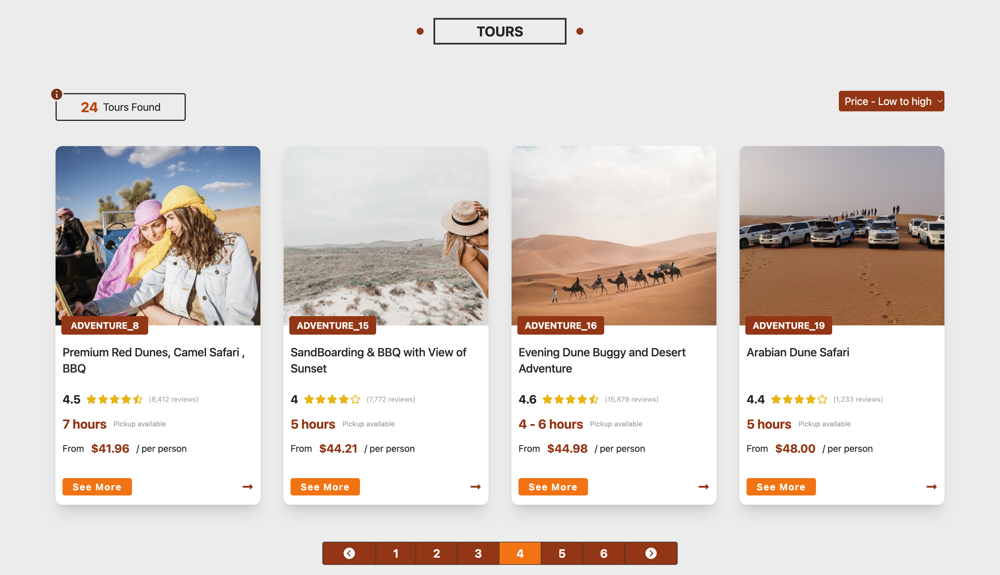
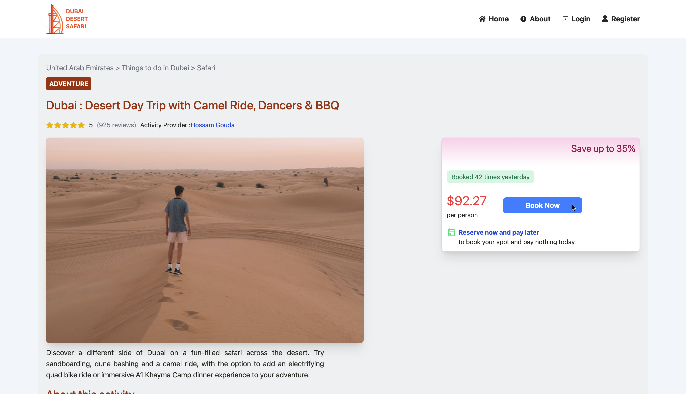
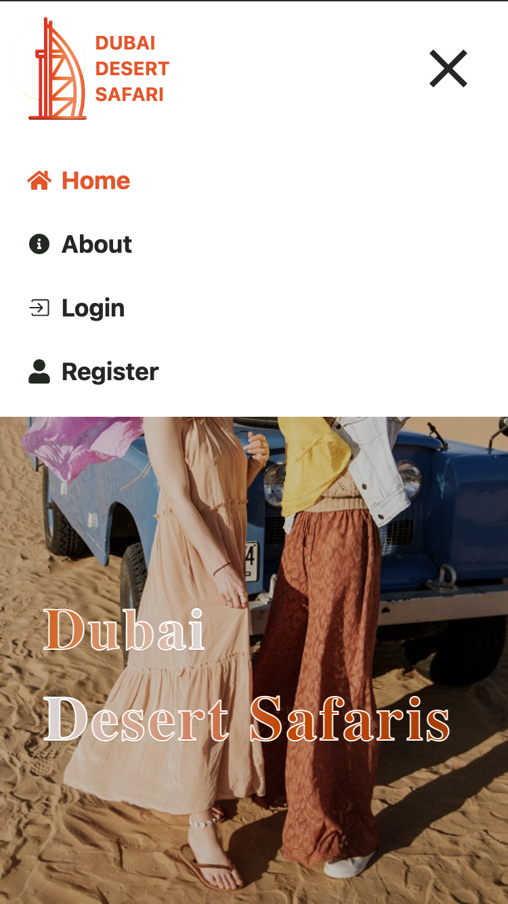
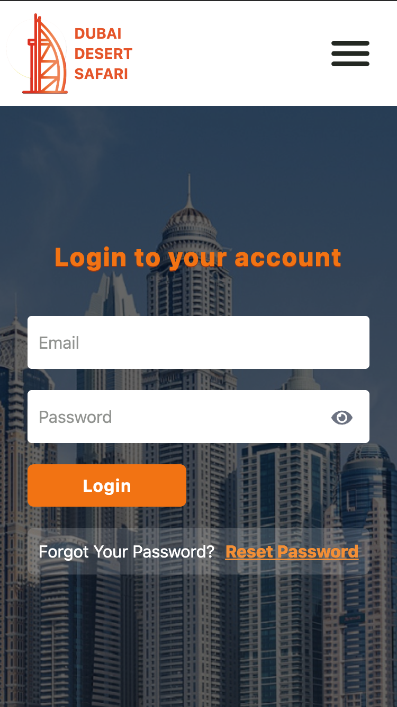
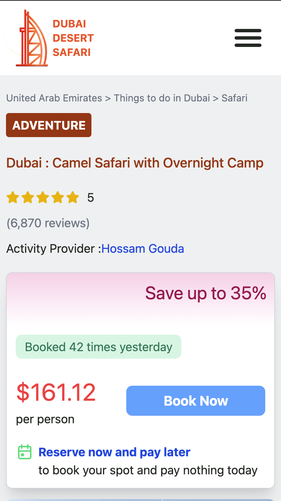

# 🌵 Dubai Desert Safari - Professional Booking Platform

<div align="center">


<br />

[**🌐 Live Demo**](https://dubaisafari.netlify.app/) | [**💻 GitHub Repository**](https://github.com/HossamGezo/dubai_safari)

</div>

---

## 🌟 Overview

A high-performance booking platform engineered with **React 19** and **Tailwind CSS 4.0**. This project showcases an **Atomic Component Architecture**, focusing on highly reusable UI logic, strict type-safety via **TypeScript**, and seamless form management using **React Hook Form** and **Zod**.

---

## 📸 Visual Journey

### 🖥️ Desktop Experience

|            Main Storefront Experience             |         Advanced Discovery & Filtering          |
| :-----------------------------------------------: | :---------------------------------------------: |
|  |  |

|                Auth Validation (Zod)                 |               Dynamic Tour Details                |
| :--------------------------------------------------: | :-----------------------------------------------: |
|  |  |

### 📱 Mobile-First Excellence

|                       Home                       |                   Navigation                    |                   Secure Login                    |                       Booking                       |
| :----------------------------------------------: | :---------------------------------------------: | :-----------------------------------------------: | :-------------------------------------------------: |
|  |  |  |  |

---

## 🛠️ Technical Highlights

### 🏗️ Architecture & Reusability

- **Atomic Design:** Developed a comprehensive library of shared UI atoms (`Button`, `InputField`, `SelectBox`) within a modular directory structure to ensure 100% design consistency.
- **Intelligent Styling:** Leveraged **Tailwind CSS 4.0** with a custom **cn utility** for optimized class management and lightning-fast styling.
- **Path Aliases:** Configured absolute import paths (**@/**) for clean and maintainable module referencing.

### ⚡ Performance & UX

- **Code Splitting:** Optimized initial load times using **React.lazy** and **Suspense** for efficient route-based delivery.
- **State-Driven UI:** Engineered complex client-side filtering and custom pagination logic to handle dynamic data rendering smoothly.
- **Clean Navigation:** Managed complex routing structures with **React Router 7**, ensuring a fast and responsive user flow.

### 🔐 Robust Form Management

- **Data Integrity:** Integrated **Zod schemas** for strict validation across Authentication and Booking workflows.
- **Secure Inputs:** Implemented real-time validation feedback and custom `PasswordField` components with visibility toggles for enhanced security.

---

## 📂 Project Structure

```text
src/
├── components/
│   ├── common/      # Reusable Atoms (Button, Field, SelectBox, Spinner)
│   └── layout/      # Shared structural components (Header, Footer, Navbar)
├── layouts/         # High-level Page wrappers (MainLayout)
├── pages/           # Feature-based views (Home, Auth, TourDetails)
├── routes/          # Centralized React Router configuration
├── types/           # Global TypeScript definitions
├── utils/           # Shared logic (Tailwind-merge, Pagination, Filters)
└── data/            # Centralized Data repository
```

---

## 🛠️ Installation & Local Setup

### 1. Clone the repository

```bash
git clone https://github.com/HossamGezo/dubai_safari.git
cd dubai_safari
```

### 2. Install dependencies

```bash
npm install
```

### 3. Run Development

```bash
npm run dev
```

---

## 👨‍💻 Connect with Me

If you have any questions about this project or want to collaborate, feel free to reach out!

- **LinkedIn:** [Hossam Gouda](https://linkedin.com/in/hossam-gouda)
- **GitHub:** [@HossamGezo](https://github.com/HossamGezo)
- **Email:** ha2ghossam10@gmail.com

---

Developed with precision by **Hossam Gouda 💠**  
**Front-End Engineer focused on building scalable and maintainable user interfaces.**
